1.first-ui: i work on button hover design.
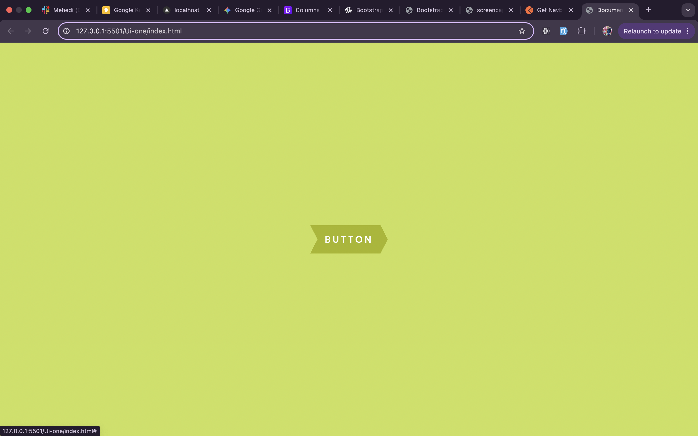
2.second-ui: button design on hover using before and after.
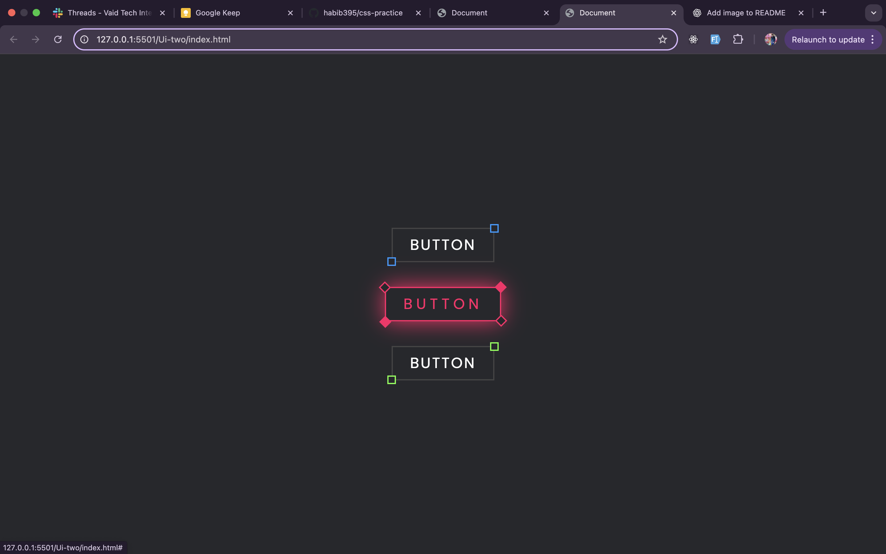
3:third-Ui: make card
4.four-ui: responsive navbar
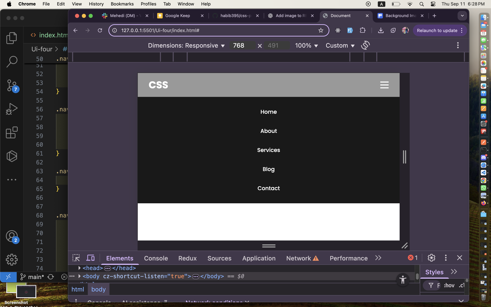
5.five-ui: banner section

6.six-ui: glassmorphism effect
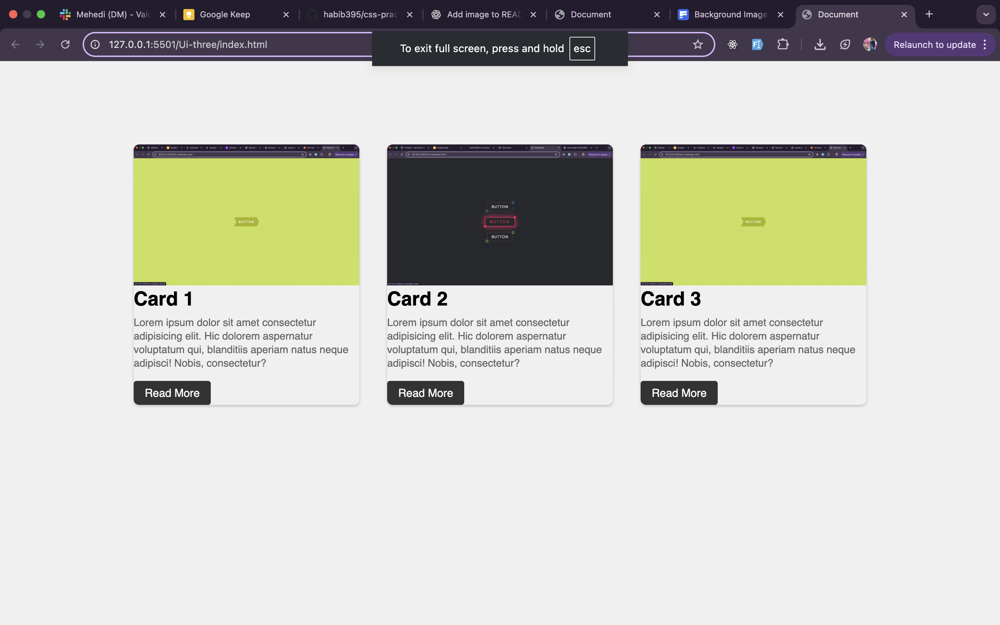
7.seven-ui:

8.eight-ui:
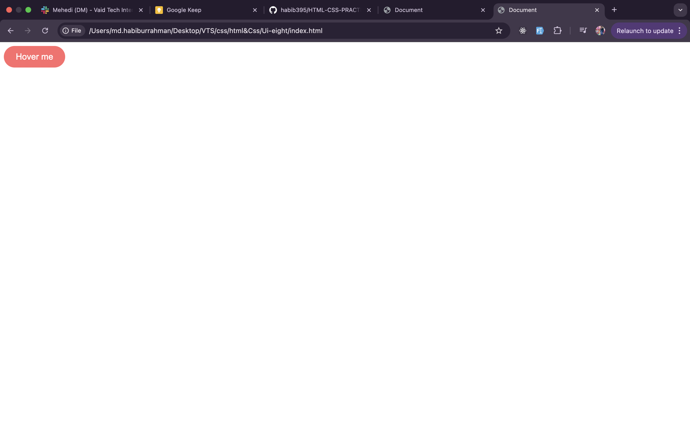
9.nine-ui:
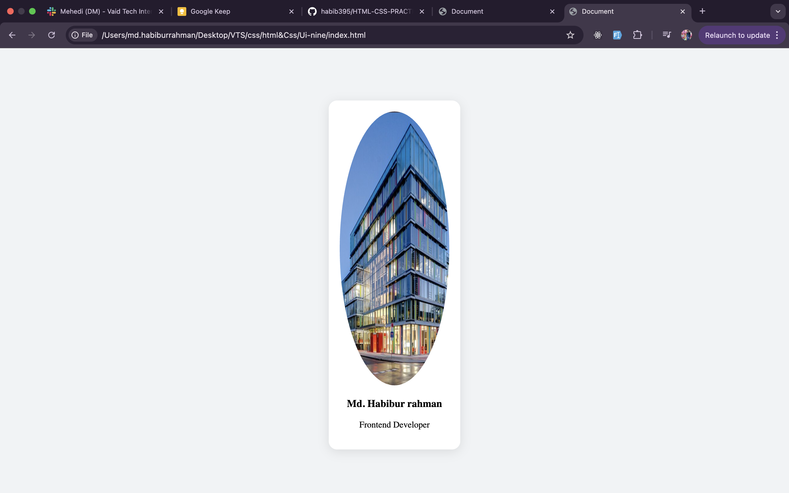
10.ui-ten:
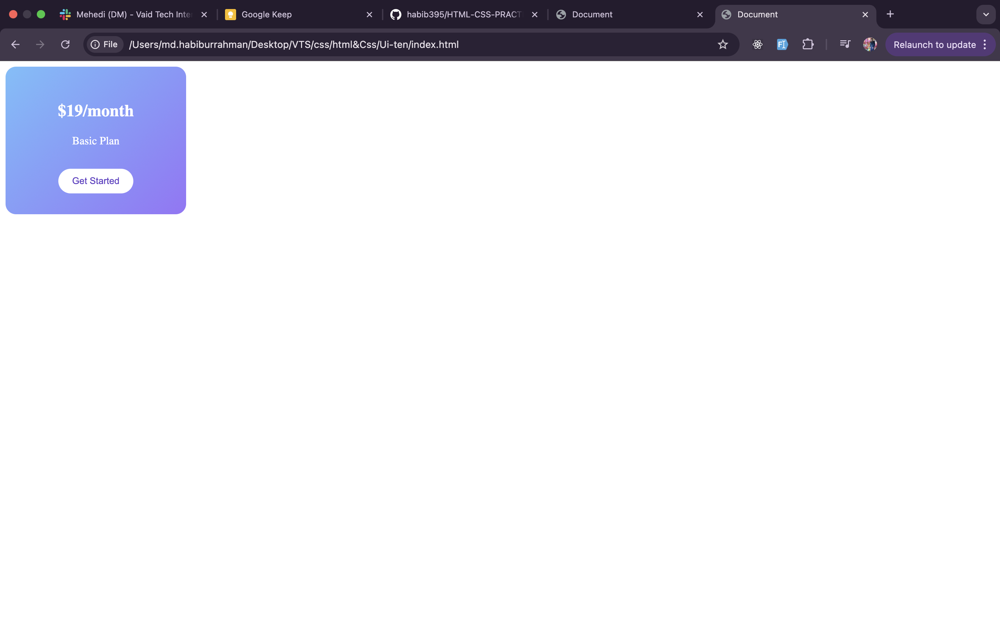
11.ui-eleven:

12.ui-twelve:
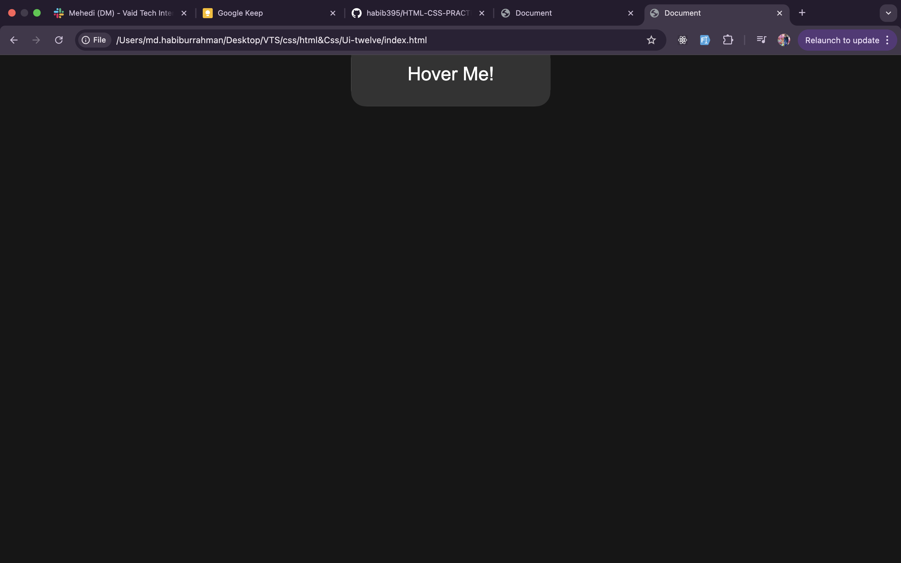
13.ui-thirdteen:
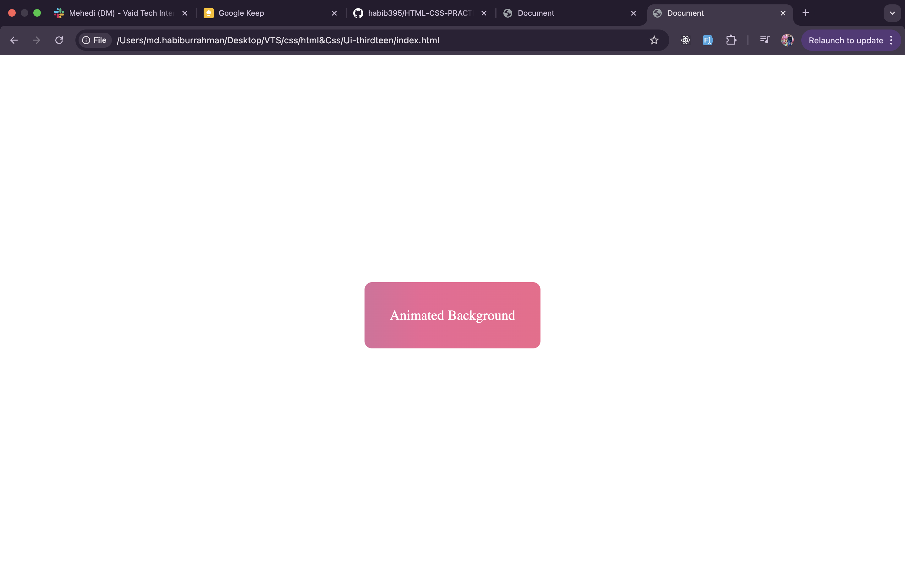
7.ui-fourteen:
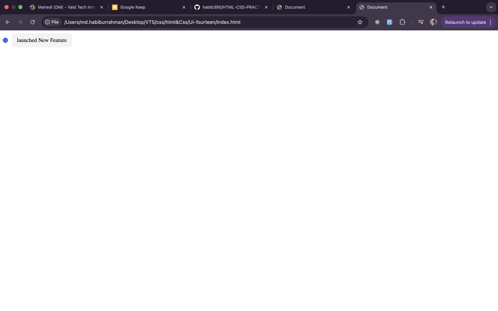
7.ui-fifteen:
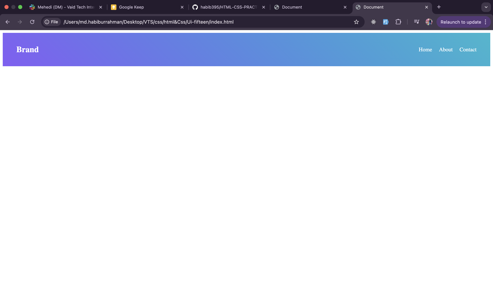
7.ui-sixteen:
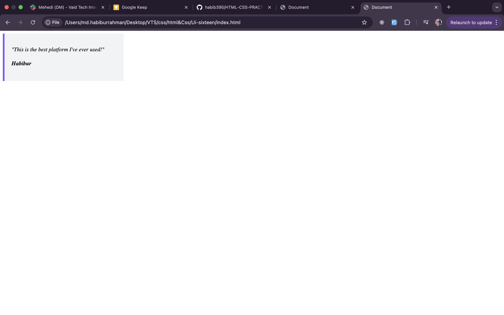
7.ui-seventeen:
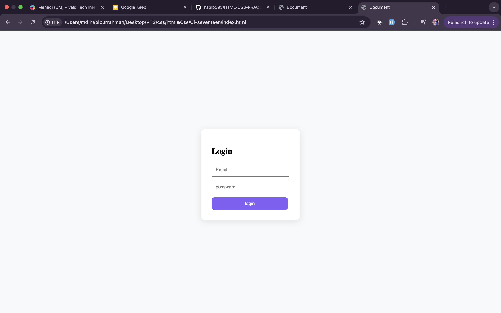
7.seven-eighteen:
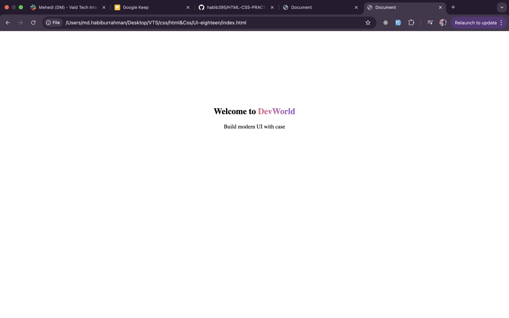
7.seven-nineteen:

7.seven-twenty:

